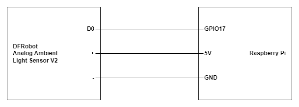

# Ambient Light Sensor

## Install Raspberry Pi GPIO

```
pip install RPi.GPIO==0.7.1
```

## Connection


## Light Detect (On/Off)

```
import RPi.GPIO as GPIO
import time

# Pin Definitions
sensor_pin = 17

# Setup GPIO
GPIO.setmode(GPIO.BCM)
GPIO.setup(sensor_pin, GPIO.IN)

try:
    while True:
        if GPIO.input(sensor_pin):
            print("Light Detected!")
        else:
            print("Darkness Detected!")
        time.sleep(1)
finally:
    GPIO.cleanup()

```