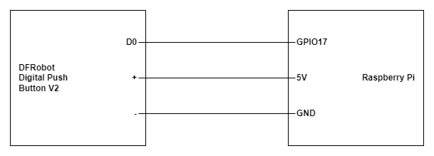

# Buttons

This repository uses the DFRobot Digital Push Button v2

## Install Raspberry Pi GPIO

```
pip install RPi.GPIO==0.7.1
```

## Connection


## Button (Toggle)
```
import RPi.GPIO as GPIO
import time

# Pin Setup:
button_pin = 17  # Assuming you connected the button to GPIO 17
GPIO.setmode(GPIO.BCM)  # Use Broadcom pin-numbering scheme
GPIO.setup(button_pin, GPIO.IN, pull_up_down=GPIO.PUD_UP)  # Button pin set as input w/ pull-up

toggle = 0  # Variable to toggle between 0 and 1

# This function will be called when the button is pressed
def button_callback(channel):
    global toggle
    toggle = 1 - toggle  # Toggle the value
    print("Button pressed! Toggle value:", toggle)

# Detect a rising edge event on the button pin, and debounce it with 300ms to avoid false triggers
GPIO.add_event_detect(button_pin, GPIO.FALLING, callback=button_callback, bouncetime=300)

try:
    print("Press the button")
    while True:
        # Main loop does nothing, just waits for button events
        time.sleep(0.1)
except KeyboardInterrupt:
    # Clean up GPIO on CTRL+C exit
    GPIO.cleanup()

GPIO.cleanup()  # Clean up GPIO on normal exit
```

## Button (Latch)
```
import RPi.GPIO as GPIO
import time

# Pin setup
button_pin = 17  # Assuming you connected the button to GPIO 17
GPIO.setmode(GPIO.BCM)  # Use Broadcom pin-numbering scheme
GPIO.setup(button_pin, GPIO.IN, pull_up_down=GPIO.PUD_UP)  # Button pin set as input w/ pull-up

try:
    print("Press or release the button")
    while True:
        # Read the button state
        if GPIO.input(button_pin) == True:  # Button is pressed when pin is LOW
            print("Button pressed - Output: 1")
        else:
            print("Button released - Output: 0")
        time.sleep(0.1)  # Small delay to debounce and reduce CPU usage
except KeyboardInterrupt:
    # Clean up GPIO on CTRL+C exit
    GPIO.cleanup()

GPIO.cleanup()  # Clean up GPIO on normal exit

```