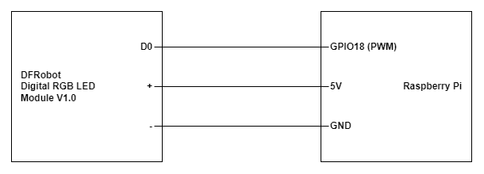

## LED

This repository uses the DFRobot DIgital RGB LED Module V1.0

## Install NEOPixel Library

```
pip install rpi_ws281x
```

## Connection


## Enable I2C / SPI

```
sudo raspi-config
select -> Interface Options 
select -> SPI (Enable)
select -> I2C (Enable)
```

## Give Hardware Registry permission to user

```
sudo usermod -a -G gpio <username>
```

## To run python code

Sudo permission is required to use rpi_ws281x library.
Please ensure you are using a GPIO pin that supports PWM (e.g. GPIO18)

```
sudo ~/<venv_name>/bin/python <file>.py
```
## Static White Light

```
from rpi_ws281x import *

# LED strip configuration:
LED_COUNT = 1        # Number of LED pixels. Adjust as needed.
LED_PIN = 18         # GPIO pin connected to the pixels (18 uses PWM!).
LED_FREQ_HZ = 800000  # LED signal frequency in hertz (800kHz)
LED_DMA = 10          # DMA channel to use for generating signal (try 10)
LED_BRIGHTNESS = 255  # Set to 0 for darkest and 255 for brightest
LED_INVERT = False    # True to invert the signal (when using NPN transistor level shift)

# Create NeoPixel object with appropriate configuration.
strip = Adafruit_NeoPixel(LED_COUNT, LED_PIN, LED_FREQ_HZ, LED_DMA, LED_INVERT, LED_BRIGHTNESS)
# Intialize the library (must be called once before other functions).
strip.begin()

def setStaticWhite(strip, brightness=255):
    """Set all LEDs to static white color."""
    color = Color(brightness, brightness, brightness)  # White color
    for i in range(strip.numPixels()):
        strip.setPixelColor(i, color)
    strip.show()

def turnOffLEDs(strip):
    """Turn off all LEDs."""
    for i in range(strip.numPixels()):
        strip.setPixelColor(i, Color(0,0,0))
    strip.show()

try:
    # Set the LEDs to static white
    setStaticWhite(strip)
    while True:
        # Keep the program running to maintain the LED color
        pass
except KeyboardInterrupt:
    # Turn off the LEDs before exiting
    turnOffLEDs(strip)

```


## Running RGB

```
import time
from rpi_ws281x import *

# LED strip configuration:
LED_COUNT = 1          # Number of LED pixels.
LED_PIN = 18           # GPIO pin connected to the pixels (must support PWM!).
LED_FREQ_HZ = 800000   # LED signal frequency in hertz (usually 800khz)
LED_DMA = 10           # DMA channel to use for generating signal (try 10)
LED_BRIGHTNESS = 255   # Set to 0 for darkest and 255 for brightest
LED_INVERT = False     # True to invert the signal (when using NPN transistor level shift)

# Create NeoPixel object with appropriate configuration.
strip = Adafruit_NeoPixel(LED_COUNT, LED_PIN, LED_FREQ_HZ, LED_DMA, LED_INVERT, LED_BRIGHTNESS)
# Intialize the library (must be called once before other functions).
strip.begin()

def colorWipe(strip, color, wait_ms=50):
    """Wipe color across display a pixel at a time."""
    for i in range(strip.numPixels()):
        strip.setPixelColor(i, color)
        strip.show()
        time.sleep(wait_ms/1000.0)

try:
    while True:
        # Color wipe animations.
        colorWipe(strip, Color(255, 0, 0))  # Red wipe
        colorWipe(strip, Color(0, 255, 0))  # Green wipe
        colorWipe(strip, Color(0, 0, 255))  # Blue wipe
except KeyboardInterrupt:
    colorWipe(strip, Color(0,0,0), 10)

```