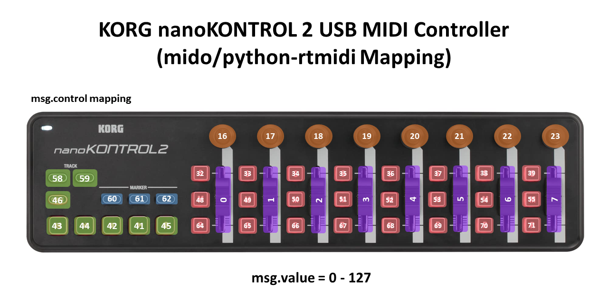

# Midi Tutorial

In this repository we will explore interfacing a Midi Controller (USB) with a Raspberry Pi

## Install mido

```
pip install mido
```

## Install rtmidi

```
pip install python-rtmidi
```

## KORG nanoKONTROL2 Mapping Diagram



## To check Midi Controller Name

```
import mido

# List all input MIDI devices
print("Input MIDI Devices:")
for input_name in mido.get_input_names():
    print(input_name)

# List all output MIDI devices
print("\nOutput MIDI Devices:")
for output_name in mido.get_output_names():
    print(output_name)

```

## To retrieve fader/button value

```
import mido

def list_midi_devices():
    """Lists all available MIDI input and output devices."""
    print("Input MIDI Devices:")
    for input_name in mido.get_input_names():
        print(input_name)
    print("\nOutput MIDI Devices:")
    for output_name in mido.get_output_names():
        print(output_name)

def open_nano_kontrol2():
    """Opens the nanoKONTROL2 device and listens for control change messages."""
    # Replace this with the exact name of your nanoKONTROL2 input port
    # if it's different from what's listed below.
    nano_kontrol2_name = "nanoKONTROL2:nanoKONTROL2 nanoKONTROL2 _ CTR 28:0"

    # Check if the nanoKONTROL2 is in the list of input names
    if nano_kontrol2_name not in mido.get_input_names():
        print(f"Device {nano_kontrol2_name} not found. Please check the device name.")
        return

    # Open the input port for the nanoKONTROL2
    with mido.open_input(nano_kontrol2_name) as inport:
        print(f"Listening to {nano_kontrol2_name} for control changes...")
        try:
            for msg in inport:
                if msg.type == 'control_change':
                    # Print out the control number and its value (fader/knob position)
                    print(f'Control: {msg.control}, Value: {msg.value}')
        except KeyboardInterrupt:
            print("Stopped listening to MIDI messages.")

if __name__ == "__main__":
    # Uncomment the next line if you want to list all available MIDI devices
    # list_midi_devices()

    # Open the nanoKONTROL2 and start listening for MIDI messages
    open_nano_kontrol2()

```